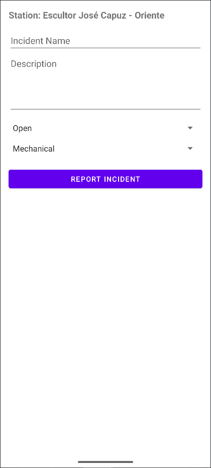

# Valenbisi (Clone)

An Android application replicating the functionality of Valencia’s Valenbisi city bike app.  
[▶️ Demo Video](https://youtu.be/GXgBDIOlGgg)

## Features
- Fetches real-time data on bike station availability via public API
- Displays interactive station list and status
- Clean, responsive UI designed in Android Studio
- Handles network requests and JSON parsing
- Quick access to station location on Google Maps

## Tech Stack
- Kotlin / Java
- Android Studio
- REST API integration
- XML layouts, RecyclerView

## How to Run
1. Clone this repo
2. Open in Android Studio
3. Build and run on an emulator or device

## Screenshots

  
  &nbsp;&nbsp;&nbsp;
  

&nbsp;

  
  &nbsp;&nbsp;&nbsp;
  

